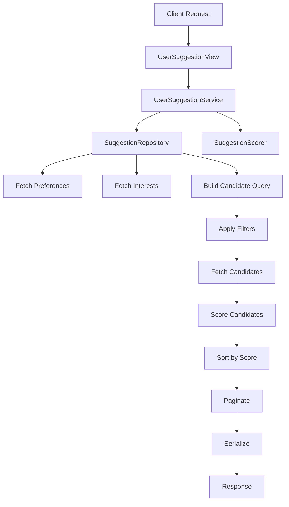
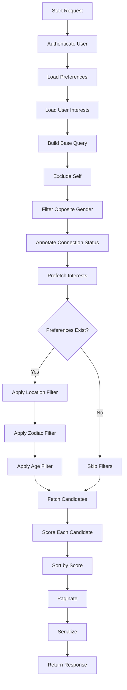
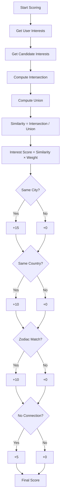

# SriSu Suggestion System – Architecture & Algorithm Documentation

## Overview

The **Suggestion System** in SriSu is responsible for recommending users to connect with, based on:

* User preferences (age, location, zodiac, etc.)
* Shared interests
* Basic compatibility rules (e.g., gender matching)
* Weighted ranking logic

This system is designed to be:

* **Scalable**
* **Explainable**
* **Easy to tune**
* **Production-ready without ML dependency**

---

## High-Level Flow



---

## System Components

### 1. View Layer

**Class:** `UserSuggestionView`

Responsibilities:

* Handles API request
* Calls service layer
* Applies pagination
* Returns response

```http
GET /api/social/user-suggestions/
```

---

### 2. Service Layer

**Class:** `UserSuggestionService`

Responsibilities:

* Orchestrates the entire flow
* Applies business logic
* Coordinates repository + scoring

Main steps:

1. Load preferences
2. Load user interests
3. Build candidate queryset
4. Apply filters
5. Score candidates
6. Sort results
7. Return ranked list

---

### 3. Repository Layer

**Class:** `SuggestionRepository`

Responsibilities:

* Handles all database queries
* Keeps ORM logic isolated

Key operations:

* Fetch user preferences
* Fetch user interests
* Build base candidate queryset
* Apply filters

---

### 4. Scoring Layer

**Class:** `SuggestionScorer`

Responsibilities:

* Assigns a score to each candidate
* Determines ranking order

---

## Detailed Algorithm Flow



---

## Filtering Logic

### Gender Matching

Current rule:

* Female → Male
* Male → Female

> ⚠️ Future improvement: Make this preference-driven instead of hardcoded.

---

### Location Filtering

Priority:

1. City (if available)
2. Country (fallback)

---

### Age Filtering

Converted into **DOB range**:

```python
latest_dob = today - min_age
earliest_dob = today - max_age
```

---

### Zodiac Filtering

If user has preference:

* Only match same zodiac

---

## Scoring Algorithm

### Formula Overview

Each candidate is scored using weighted factors:

| Factor               | Weight |
| -------------------- | ------ |
| Interest Similarity  | 60     |
| Same City            | 15     |
| Same Country         | 10     |
| Zodiac Match         | 10     |
| No Active Connection | 5      |

---

### Interest Similarity (Core Metric)

Uses **Jaccard Similarity**:

```text
similarity = intersection / union
```

Example:

```text
User A: {music, travel, movies}
User B: {music, travel, sports}

intersection = {music, travel} → 2
union = {music, travel, movies, sports} → 4

similarity = 2 / 4 = 0.5
```

---

### Scoring Flow



---

## Ranking Strategy

Candidates are sorted by:

```python
(score DESC, created_at DESC)
```

Meaning:

* Highest compatibility first
* Newer users preferred in tie

---

## Pagination

Handled by:

```python
PageNumberPagination
```

Response format:

```json
{
  "data": {
    "count": 100,
    "next": "...",
    "previous": "...",
    "results": [...]
  },
  "message": "User suggestions fetched successfully."
}
```

---

## Performance Optimizations

### 1. Prefetching

```python
prefetch_related(...)
```

Avoids N+1 queries when loading interests.

---

### 2. Candidate Limiting

```python
queryset[:DEFAULT_CANDIDATE_LIMIT]
```

Prevents loading excessive users into memory.

---

### 3. Annotation

```python
annotate(has_active_connection=Exists(...))
```

Avoids extra queries during scoring.

---

## Future Improvements

### 1. Preference-Based Gender Matching

Replace hardcoded logic with:

* `preferred_gender`
* `interested_in`

---

### 2. Profile Quality Score

Add factors:

* profile image
* bio
* interests count

---

### 3. Activity-Based Ranking

Boost:

* recently active users

---

### 4. Exploration vs Exploitation

Mix:

* 80% high match
* 20% random discovery

---

### 5. ML-Based Recommendation (Later Stage)

Once enough data exists:

* collaborative filtering
* behavioral similarity
* interaction-based ranking

---

## Design Principles

This system follows:

### Separation of Concerns

* View → API handling
* Service → business logic
* Repository → DB access
* Scorer → ranking logic

---

### Scalability

* Query filtering in DB
* Scoring in controlled batch
* Easy to optimize later

---

### Explainability

Each recommendation is:

* deterministic
* debuggable
* tunable

---

## Summary

The SriSu Suggestion System is a **rule-based recommendation engine** that:

* Filters users based on preferences
* Scores candidates using weighted similarity
* Ranks results for best match
* Returns paginated suggestions

It is:

* **Production-ready**
* **Extensible**
* **Efficient for early-stage scaling**

---

## Final Note

This architecture is intentionally designed to:

* Avoid premature ML complexity
* Allow fast iteration
* Support future evolution into advanced recommendation systems

---

**End of Document**
